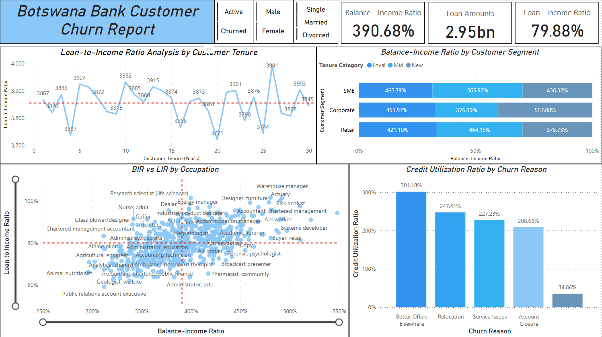

# ***Botswana Bank Customer Churn Report***

# ***Project Overview***  
This project analyzes customer data from **Botswana Bank** to understand churn behavior, identify key patterns, and derive actionable insights for improving **customer retention** and **business profitability**.

# ***Purpose of the Data*** 
The main objectives of this analysis are to:  
- Identify the **key drivers** behind customer churn.  
- Understand **customer behavior** and **demographics**.  
- Provide **recommendations** to improve retention strategies.  
- Segment customers based on **risk** and **profitability** factors.

# ***Data Description*** 
The dataset includes **115,640 customers** and consists of **34 columns** covering:  

- **Demographic Information**: Age, Gender, Marital Status, Date of Birth.  
- **Financial Data**: Income, Credit Score, Outstanding Loans, Balance.  
- **Behavioral Data**: Number of Products, Complaints, Communication Preferences.  
- **Churn Details**: Churn Flag, Reason, Date.  

### *Key Columns:*
- `Churn_Flag`: Indicates if a customer has churned.  
- `Customer_Tenure`: Duration of customer relationship with the bank.  
- `Risk_Indicator`: Categorizes customers as High, Mid, or Low Risk.  

# ***Technical Overview*** 

*Tools Used*:  
- **Excel** – For Data Cleaning and Structuring.
- **SQL** – For Exploratory Data Analysis (EDA).  
- **Python** – For deeper statistical analysis.  
- **Power BI** – For Data Visualization. 

*Libraries/Technologies*:  
- `Pandas`, `NumPy` – Data manipulation  
- SQL – Complex querying  
- Correlation and Regression analysis techniques  

# ***Executive Summary*** 

### *Who churned the most?*  
- **Divorced customers** have the highest churn rates among all marital statuses. This highlights a life-stage-related churn pattern and reveals a need for personalized retention strategies.

### *What is the age difference between churned and non-churned customers?*  
- **No major difference**:  
  - Average age of active customers: **47.2**  
  - Average age of churned customers: **47.08**  

### *What is the gender distribution among churned customers?*  
- **Very balanced**:  
  - Churned Males: **7,070**  
  - Churned Females: **7,024**  

### *How many products does an average active customer hold?*  
- Median number of products for active customers: **3**

### *Retention Rate by Segment:*  
- **Corporate**: 87.9%  
- **Retail**: 87.84%  
- **SME**: 87.7%

### *Churn Rate by Communication Channel:*  
- **Email**: 12.2%  
- **Phone**: 12.2%

### *Risk Segmentation:*  
- High-risk customers typically have **low credit scores** and **poor credit history**.

### *Top Churn Reasons:*  
- **Service Issues**, **Account Closure**, **Relocation**

### *Occupational Insights:*  
- Highest churn professions include **Engineers**, **Biochemists**, and **Surveyors**

### *Credit Score Stats:*  
- **Max**: 850  
- **Min**: 300  
- **Average**: 574.29  

# ***Key Insights*** 

### *1. Churn & Marital Status*  
- Divorced individuals are significantly more likely to churn, suggesting life transitions affect banking relationships.

### *2. Tenure vs Credit Score*  
- Correlation = **-0.002** ➝ No strong link. Tenure doesn't predict creditworthiness.

### *3. Complaints Correlate with Churn*  
- Positive correlation = **0.20** ➝ More complaints = higher churn probability.

### *4. Risk Category Breakdown*  
- **Low Risk** = 63.57% of customers. These are the most stable group.

### *5. Engagement Score*  
- Average = **5.60**. Higher scores align with **greater loyalty** and reduced churn.

### *6. Complaint Rate by Tenure*  
- Surprisingly similar:  
  - Loyal Customers = 5.00  
  - New Customers = 5.01  

### *7. Income Gap*  
- Low-income customers have slightly higher churn: **12.33%**

### *8. Credit Utilization by Segment*  
- Retail = **2.07**  
- Corporate = **1.14**

### *9. Product Penetration*  
- Median number of products per customer is **~3** across all segments.

# ***Recommendations***

## **1.Target Divorced and Low-Income Customers:**

- **Recommendation**: Launch personalized loyalty programs for divorced and low-income customers.

- **Action Plan**: Create offers and programs tailored to these groups, such as financial wellness workshops or exclusive discounts. Use personalized communication channels like email or app notifications to engage these customers.

- **Outcome**: By addressing their unique needs, churn can be reduced, improving retention and customer loyalty.

## 2. **Enhance Service Quality:**

- **Recommendation**: Focus on reducing service issues, a top churn reason.

- **Action Plan**: Improve customer service training, set clear SLAs for issue resolution, and gather customer feedback for continuous improvement. Monitor key metrics like response times and satisfaction.

- **Outcome**: A more efficient service will reduce churn, increase customer loyalty, and improve brand reputation.

## 3. **Proactive Risk Management:**

- **Recommendation**: Improve high-risk customers’ credit history through financial counseling.

- **Action Plan**: Identify high-risk customers and offer personalized financial advice to help them improve credit scores. Introduce tools to track progress and send timely reminders.

- **Outcome**: Managing high-risk customers will prevent churn due to financial insecurity and build trust with at-risk segments.

## 4. **Optimize Communication:**

- **Recommendation**: Explore newer channels like App Notifications since churn rates are equal in Email and Phone.

- **Action Plan**: Implement in-app notifications for real-time updates and personalized offers. Use push notifications to drive engagement and provide instant support through chatbots.

- **Outcome**: By diversifying communication, customer engagement will increase, leading to a reduction in churn.

## 5. **Complaint Handling Improvements:**

- **Recommendation**: Implement a quick-response system to handle complaints effectively.

- **Action Plan**: Prioritize complaints, empower reps to resolve issues quickly, and track resolution times. Use a digital platform for easy complaint submission and status tracking.

- **Outcome**: Faster resolution of complaints will improve customer satisfaction and reduce churn.

## 6. **Customer Segmentation Focus:**

- **Recommendation**: Focus on Retail customers where high credit utilization and churn risk exist.

- **Action Plan**: Tailor financial products and offers for retail customers, such as credit limit increases and cashback incentives. Monitor credit usage and offer advice when usage spikes.

- **Outcome**: Targeted strategies for retail customers will lower churn and foster greater loyalty, leading to higher profitability.

# ***Data Limitations*** 
- No access to **real-time transactions** limits behavioral pattern mining.  
- **No economic context** like inflation or interest rates considered.  
- **Date columns** could be better used for tenure & seasonality trends.  
- Methodologies for **Engagement Score** and **Balance-to-Income Ratio** are not standardized across segments.

# ***Conclusion*** 
Botswana Bank's churn behavior is **moderately influenced** by marital status, income, service quality, and risk indicators.  
By targeting **divorced**, **low-income**, and **high-risk** customers through **personalized**, **proactive**, and **digital-first strategies**, the bank can significantly reduce churn and drive **sustainable profitability**.

